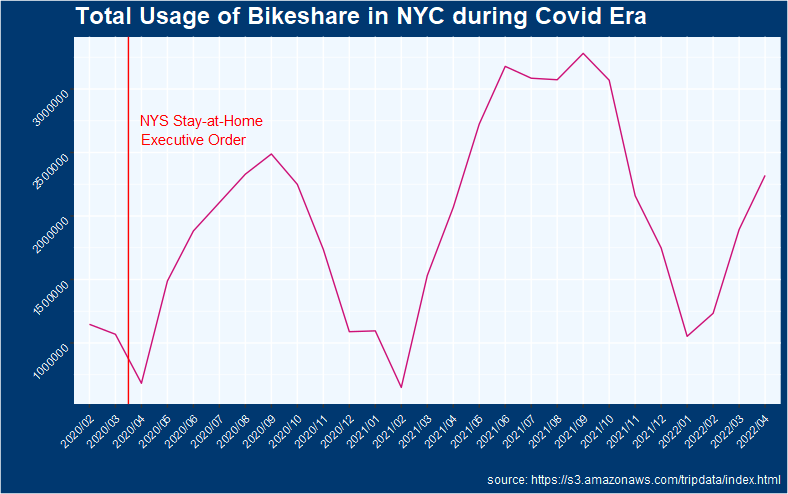
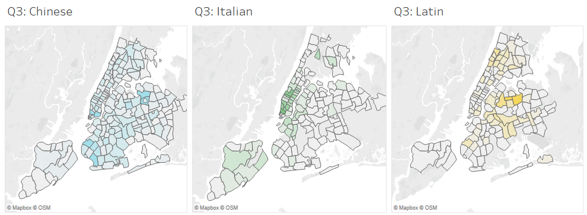

# viz-a-day
Sho-Viz project extension.  
Just posting a viz daily - mostly spin-offs, no context or cause on here (I do storytelling on other platforms) so feel free to feel what you feel!

*All data visualizations on here are my original. Contact me for anything about the process!
 

Title|Code/Tool|Viz|Data
-|-|-|-
**Citibike Usage during Covid Era**|[**R**](codes/shoviz1_citi-line.r)||https://s3.amazonaws.com/tripdata/index.html
**NYC Restaurnt Geographical Distribution by Cuisine Types (2010-2017)** | [**Tableau**](https://public.tableau.com/app/profile/shokolatte.tachikawa/viz/CourseraNYUNYCRestaurantInspection_ShokolatteTachikawa/DistributionMap) | | https://www.kaggle.com/datasets/new-york-city/nyc-inspections 

 
 
 
 
IG: https://www.instagram.com/sho.viz.today/

copyright (c) Showee of Sho-Viz-A-Day
